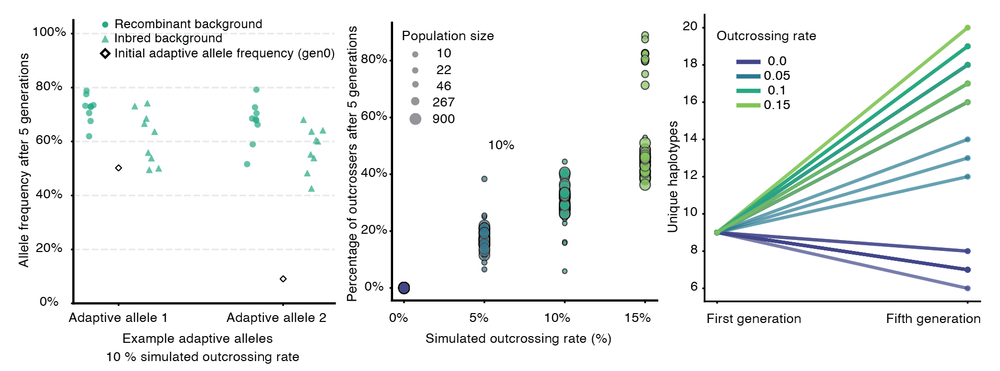

# simulate_recombination

SLiM + Snakemake pipeline for forward-in-time simulations studying how recombination through outcrossing affects adaptive evolution in *Arabidopsis thaliana*. Simulations are seeded with GrENE-Net founder population genomic data (~3.2M SNPs, 231 ecotypes) and track adaptive allele frequency dynamics, haplotype diversity, and population-level outcrossing rates across 5 generations.

---

## Biological question

*A. thaliana* is predominantly selfing (~97% selfing rate), but outcrossing occurs at low rates. Does even a small amount of recombination through outcrossing meaningfully change the trajectory of adaptive evolution? The simulations test four outcrossing rates (0%, 5%, 10%, 15%) under strong selection and varying environmental shifts.

---

## Simulation parameters

| Parameter | Values |
|-----------|--------|
| Outcrossing rate | 0%, 5%, 10%, 15% |
| Environmental shift (std deviations) | 1, 2, 3 |
| Heritability (h²) | 0.7 |
| Selection strength (Vs) | 0.1 (strong) |
| Population size cap | 900 per generation |
| Generations | 5 |
| Replicates per combination | 10 simulation × 3 architecture |

Simulations use tree-sequence recording for efficient tracking of neutral variation, with adaptive loci monitored explicitly through generations.

---

## Key results



*Left: Adaptive allele frequency after 5 generations (10% outcrossing rate), comparing recombinant vs inbred backgrounds. Both reach high frequency (~60–80%), with variance across replicates. Center: Percentage of outcrossers observed after 5 generations vs simulated outcrossing rate, by population size — larger populations maintain more outcrossers. Right: Unique haplotypes from generation 1 to 5 by outcrossing rate — outcrossing generates haplotype diversity while selfing erodes it.*

### Summary of findings

- **Adaptive allele frequencies** rise to 60–80% after 5 generations under strong selection, in both recombinant and inbred backgrounds. Recombination does not strongly change the direction of adaptation but increases variance across replicates.
- **Realised outcrossing rate** scales with simulated rate and population size: larger populations (N=900) sustain more outcrossers, while small populations (N=10) show near-zero outcrossing even when simulated at 5–10%.
- **Haplotype diversity**: Without outcrossing (0%), unique haplotypes decline from generation 1 to 5 as selfing homogenises the population. With outcrossing (5–15%), haplotype diversity increases, with the effect scaling with rate. This has implications for the availability of novel genotypic combinations under selection.

---

## Repository structure

```
Snakefile                          # Main Snakemake workflow
config.yaml                        # Parameters: outcrossing rates, selection, heritability, replicates
environment.yml                    # Top-level conda environment
envs/                              # Per-rule conda environments
scripts/
├── arabidopsis_evolve_treeseq.slim  # SLiM model with outcrossing logic
├── build_population_for_sim.py      # Build initial population from GrENE-Net VCF
├── slim.sh                          # Wrapper to run SLiM with parameters
├── calc_ecotype_counts.py           # Count ecotypes and outcrossers from tree sequences
├── calc_af_adaptive_alleles.py      # Track adaptive allele frequencies
└── tree_postprocessing.py           # Convert tree sequences to VCF
analysis/                          # Jupyter notebooks for result analysis
treeseq/                           # Tree sequence conversion and testing
profiles/slurm/                    # SLURM cluster execution profile
figures/                           # Result plots
```

---

## Usage

1. Clone the repository

2. Set up the environment:
   ```bash
   mamba env create -f environment.yml
   conda activate simulate_recombination
   ```

3. Edit `config.yaml` to set outcrossing rates, selection strength, and replicate counts

4. Run:
   ```bash
   snakemake --use-conda --cores <N>
   # On a cluster:
   snakemake --use-conda --profile profiles/slurm
   ```

---

## Tools & dependencies

- [SLiM](https://messerlab.org/slim/) — forward-time population genetics simulator with tree-sequence recording
- [Snakemake](https://snakemake.readthedocs.io/) — workflow management
- [tskit](https://tskit.dev/) / [msprime](https://msprime.readthedocs.io/) — tree sequence analysis
- Python 3, R, Jupyter
